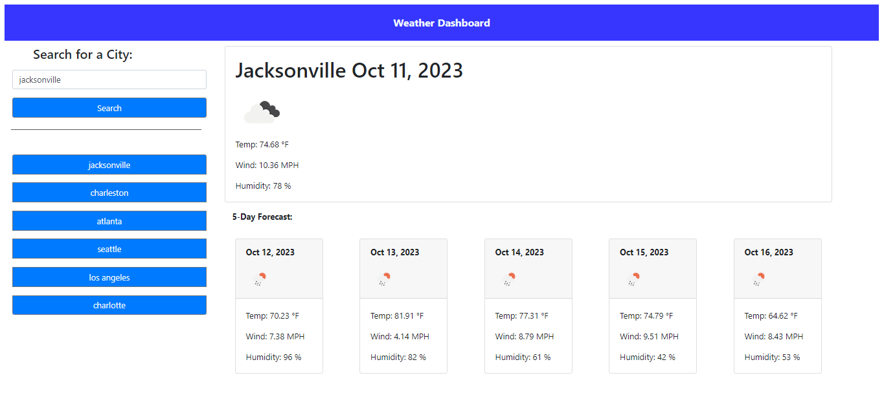

# POISON-GHOST

## Description
This Zachary McDowell's Module 6 Challenge, the Weather Dashboard.
 
This application is used to track weather conditions. Type the name of a US city and be prompted with city's current forecast, as well as the next 5 day's forecast. It will tell you the temperature, wind speed, and humidity levels, plus a little icon to show what the weather is like. 

Link to Deployed Application:
https://imshocker.github.io/poison-ghost/

## Installation

N/A

## Usage

Track a specific city's weather forecast for today and the next 5 days. The application will save your last 8 searches, you can quickly search again by clicking the previous search button.

## Credits

N/A

## License

N/A

---
